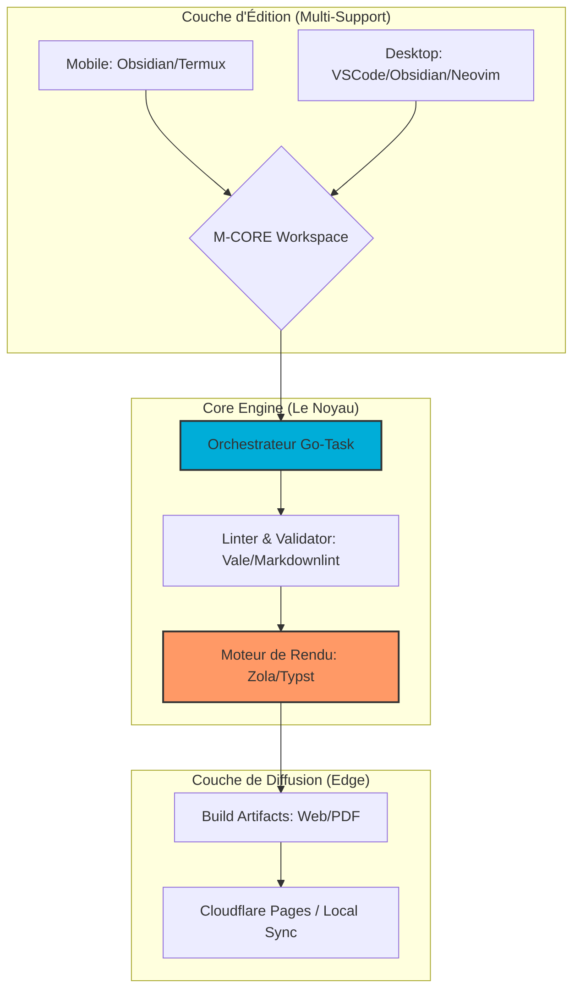

# 🌌 M-CORE (Mobile-first Continuity & Offline Rendering Engine)

**Infrastructure de publication technique résiliente : L'excellence du Docs-as-Code, du mobile au Desktop.** *Garantir la continuité de production en environnements à ressources contraintes (Énergie/Connectivité).*


-----

## 📌 Vision Industrielle

**M-CORE** est une infrastructure hybride conçue pour briser la dépendance aux infrastructures fixes. Dans un contexte de volatilité énergétique et réseau, M-CORE transforme n'importe quel terminal — mobile ou station de travail — en une **unité de production autonome** capable de générer des actifs numériques certifiés (Web/PDF) aux standards d'entreprise.

### Pourquoi M-CORE ?

* **Résilience (Offline-First) :** Zéro dépendance au Cloud pour le cycle de build.
* **Continuité Mobile :** Unification du workflow entre Android (Termux) et Desktop.
* **Ingénierie Frugale :** Optimisation radicale pour ARM64 afin de maximiser l'autonomie sur batterie.

-----

## 🏗️ Architecture de l'Écosystème (IaaS Portable)

Le diagramme suivant illustre la couche d'abstraction permettant la continuité du travail sans friction entre les supports.



-----

## 🛡️ Gouvernance & Standards

Le respect des cycles de vie et des normes de qualité est central à M-CORE.
Consultez notre [Guide de Gouvernance Digitale](https://github.com/M-Core-Engineering/.github/blob/main/README.md) pour comprendre nos protocoles SDLC.

## 🛠️ Spécifications Techniques & Gouvernance

### 1\. Standards de Qualité (M-CORE STD)

Tout actif produit au sein de cet écosystème doit franchir les barrières de validation suivantes :

| Domaine | Vecteur de Contrôle | Standard Appliqué |
| :--- | :--- | :--- |
| **Sémantique** | `Vale` | Ton professionnel et pédagogique strict. |
| **Syntaxe** | `markdownlint-cli2` | Conformité `M-Spec` (YAML Frontmatter). |
| **Rendu PDF** | `Typst` | Précision typographique industrielle. |
| **Orchestration** | `Go-Task` | Syntaxe POSIX pure via interpréteur `Gosh`. |

-----

### 2\. Sécurité & Intégrité

* **Secret Management :** Scan systématique via `Gitleaks` pour prévenir toute fuite de credentials en mobilité.
* **Auditabilité :** Chaque modification est versionnée sous Git, assurant une traçabilité totale (SDLC).

-----

## 🚀 Guide d'Installation Rapide

M-CORE utilise l'abstraction de tâches pour garantir la reproductibilité des builds en tout lieu (Windows, Linux, Android). Pour pouvoir prendre en main votre ecosysteme M-core, vous devez executer dans l'ordre les 3 commandes presenter a la suite.

### a. Clonage de l'infrastructure complète**

```bash
git clone --recursive https://github.com/M-Core-Engineering/m-core.git
```

### b. Initialisation de l'environnement local

```bash
task init
```

### c. Installation des outils necessaire a la bonne marche de l'ecosysteme

```bash
task setup
```

-----

## ⚖️ Philosophie & Retour sur Investissement (ROI)

* **Souveraineté des Données :** L'intégralité du savoir est stockée en local, synchronisée uniquement par choix.
* **Efficacité Temporelle :** Réduction du "bruit" et de la distraction en isolant le processus de production.
* **Professionnalisme Accru :** Production de livrables dont la qualité formelle égale celle des grandes maisons d'édition.

-----

## 📊 Roadmap du MVP

* [x] Définition des standards d'édition (syntaxe **M-Spec**).
* [ ] **Phase 1 :** Finalisation de l'orchestrateur multi-OS (Go-Task).
* [ ] **Phase 2 :** Déploiement automatisé sur la couche Edge (Cloudflare).
* [ ] **Phase 3 :** Client natif haute performance (Tauri/Rust).

-----

**Mainteneur Principal** : [Nguetsa Lorein Du Perron](https://github.com/lorein-duperron)

**Organisation** : [M-CORE Engineering](https://github.com/M-Core-Engineering)

**Licence** : [Apache License 2.0](https://www.apache.org/licenses/LICENSE-2.0) — *Garantissant la liberté d'usage et la protection des contributions.*

> *"Passer de l'artisanat à la rigueur : La donnée devient un actif, le mobile devient une usine."*
