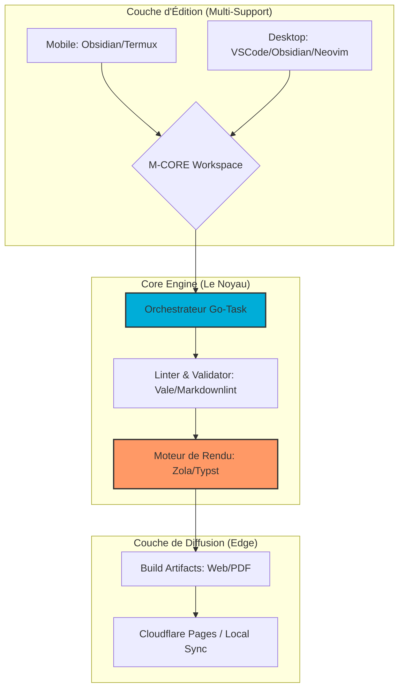

# 🌌 M-CORE (Mobile-first Continuity & Offline Rendering Engine)

**Infrastructure de publication technique résiliente : L'excellence du Docs-as-Code, du mobile au Desktop.**  
*Garantir la continuité de production en environnements à ressources contraintes (Énergie/Connectivité).*


---

## 📖 Sommaire

- [🌌 M-CORE (Mobile-first Continuity \& Offline Rendering Engine)](#-m-core-mobile-first-continuity--offline-rendering-engine)
  - [📖 Sommaire](#-sommaire)
  - [📌 Vision Industrielle](#-vision-industrielle)
    - [Pourquoi M-CORE ?](#pourquoi-m-core-)
  - [🏗️ Architecture \& Anatomie](#️-architecture--anatomie)
    - [1. Workflow Global (IaaS Portable)](#1-workflow-global-iaas-portable)
  - [📦 Anatomie de l'Écosystème](#-anatomie-de-lécosystème)
  - [💻 Matrice de Compatibilité](#-matrice-de-compatibilité)
  - [🛡️ Standards de Qualité (M-CORE STD)](#️-standards-de-qualité-m-core-std)
  - [🚀 Guide d'Installation Rapide](#-guide-dinstallation-rapide)
    - [1. Prérequis](#1-prérequis)
    - [2. Procédure de déploiement](#2-procédure-de-déploiement)
      - [a. Clonage de l'infrastructure complète](#a-clonage-de-linfrastructure-complète)
  - [⚖️ Philosophie \& ROI](#️-philosophie--roi)

---

## 📌 Vision Industrielle

**M-CORE** est une infrastructure hybride conçue pour briser la dépendance aux infrastructures fixes. Dans un contexte de volatilité énergétique et réseau, M-CORE transforme n'importe quel terminal — mobile ou station de travail — en une **unité de production autonome** capable de générer des actifs numériques certifiés (Web/PDF) aux standards d'entreprise.

### Pourquoi M-CORE ?

* **Résilience (Offline-First) :** Zéro dépendance au Cloud pour le cycle de build.
* **Continuité Mobile :** Unification du workflow entre Android (Termux) et Desktop.
* **Ingénierie Frugale :** Optimisation radicale pour ARM64 afin de maximiser l'autonomie sur batterie.

---

## 🏗️ Architecture & Anatomie

### 1. Workflow Global (IaaS Portable)



## 📦 Anatomie de l'Écosystème

Le projet est structuré en modules indépendants pour garantir une maintenance granulaire et une scalabilité optimale :

* [m-core](https://github.com/orgs/M-Core-Engineering/m-core) : Dépôt "Umbrella" gérant l'orchestration et l'unification des modules via **`Git Submodules`**.
* [.github](https://github.com/orgs/zM-Core-Engineering/.github) : Socle de gouvernance (Templates d'issues, PR, et profils d'organisation).
* [.task](https://github.com/orgs/M-Core-Engineering/.task) : Bibliothèque centrale de scripts d'automatisation (**Taskfiles**) partagée entre tous les services.
* [spec](https://github.com/orgs/M-Core-Engineering/spec) : centre de definition des contrats et normes de validation des schemas et configuration, assurant la standardisation des procedes mises en place dans l'ecosysteme.

> [!Note]
> M-CORE intègre également des modules privés pour les déploiements industriels spécifiques (Mobile App, Showcase).

---

## 💻 Matrice de Compatibilité

| OS | Shell Interne | Architecture | Statut |
| --- | --- | --- | --- |
| **Android (Termux)** | gosh (POSIX) | ARM64 | ✅ Supporté |
| **Windows 10/11** | PowerShell/CMD | x86_64 | ✅ Supporté |
| **Linux (Debian/Arch)** | Bash/Zsh | ARM64 / x86_64 | ✅ Supporté |
| **macOS** | Zsh | Apple Silicon | ✅ Supporté |

---

## 🛡️ Standards de Qualité (M-CORE STD)

| Domaine | Vecteur de Contrôle | Standard Appliqué |
| --- | --- | --- |
| **Sémantique** | `Vale` | Ton professionnel et pédagogique strict. |
| **Syntaxe** | `markdownlint` | Conformité M-Spec (YAML Frontmatter). |
| **Rendu PDF** | `Typst` | Précision typographique industrielle. |
| **Orchestration** | `Go-Task` | Syntaxe POSIX pure via interpréteur Gosh. |

---

## 🚀 Guide d'Installation Rapide

### 1. Prérequis

Avant de commencer, assurez-vous d'avoir installé :

* Git (2.30+)
* Go-Task (3.30+)

### 2. Procédure de déploiement

#### a. Clonage de l'infrastructure complète

```bash
git clone --recursive https://github.com/orgs/M-Core-Engineering/m-core
cd m-core
# b. Initialisation de l'environnement (Submodules & .env)
task init
# c. Installation automatique des dépendances (Go, Vale, Typst)
task setup
```

---

## ⚖️ Philosophie & ROI

* **Souveraineté des Données** : L'intégralité du savoir est stockée en local.
* **Efficacité Temporelle** : Réduction du "bruit" numérique en isolant le processus de production.
* **Professionnalisme Accru** : Livrables de qualité "maison d'édition".

---

**Mainteneur Principal** : Nguetsa Lorein Du Perron
**Organisation** : M-CORE Engineering
**Licence** : Apache License 2.0
